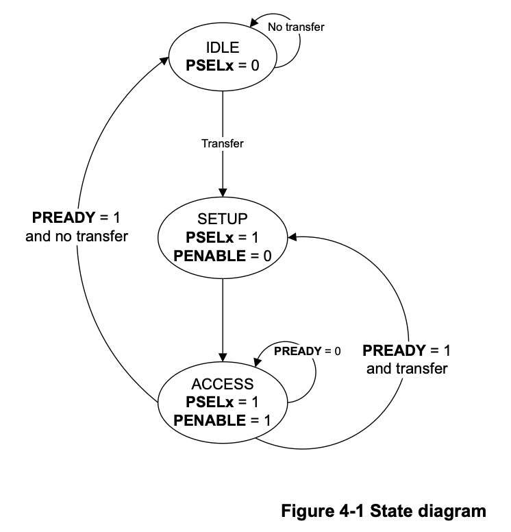

# APB (Advanced Peripheral Bus)

# Introduction

본 문서에서는 AMBA APB (Advanced Peripheral Bus) 인터페이스에 대해서 설명합니다.

# Key Features

- 가장 단순한 AMBA Bus. (low-cost interface)
- Optimized for low-bandwidth, low-power Peripheral Connection(UART/I2C/SPI/GPIO/Timer)
- Synchronous Protocol, Every transfer takes at least 2-cycle to complete. << 제일 중요.
- 한 번에 하나의 Transaction만 처리 가능. (non-Pipelined)
- AXI/AHB <> APB bridge 방식으로 고성능 버스 트랜잭션을 Register R/W로 단순 변환해 연결. (Requester <> Completer, Same with Master <> Slave)

# Needs

- Peripheral Register 접근은 전송량이 작고, Delay에 매우 민감하지 않으며, IP가 많아 Interface의 단순성이 중요함.
- 따라서 고성능 버스의 복잡한 기능을 Peripheral 까지 끌고 가면 면적/전력/검증 비용만 증가함.

# **Design Philosophy**

- APB는 의도적으로 단순함.
1. No-pipelined: 주소/제어를 먼저 내고, 그 다음 clk 에 enable 로 액세스 확정
2. No-burst Mode: 매 전송이 독립적임
3. No-outstanding: 동시에 여러 트랜잭션을 걸어두지 않음
4. arbitration/ID 개념이 사실상 없음 (단일 Master 구조)

- 그 대신 얻는 이점.
1. Interface, Slave Logic이 매우 작음
2. Power / Area 절감
3. Verification이 쉬움

# Topology

- High-performance bus(AXI/AHB): CPU/DMA/메모리 컨트롤러가 붙는 고성능 영역
- Bridge(AXI2APB/AHB2APB): 고성능 트랜잭션을 APB 형식으로 변환
- APB Bus**: 여러 peripheral slave가 매달림
- Address decoder: PADDR 상위 비트로 어떤 Slave를 선택할지 결정
- Peripheral slave: 내부 레지스터 파일 + APB Slave 인터페이스

APB는 보통 단일 Master(Bridge) + 다수 Slave 형태. (1:N)

# Main Signal Descriptions

**Global Signals**

- `PCLK`, `PRESETn`: clock, reset Signal

**Master → Slave**

- `PADDR`: Address → Decoder로 들어가서 어떤 slv 에 접근할 건지 결정.
- `PSELx`: Select → Decoder에서 결정된 slv sel
- `PENABLE`: Enable → Access phase 표시
- `PWRITE`: R/W mode (R:0, W:1)
- `PWDATA`: Write data, can be 8, 16, 32 bits

**Slave → Master**

- `PREADY`: Ready (Master의 명령을 끝냈다는 flag)
- `PRDATA`: Read data

(APB3)

- `PSLVERR`: Error Response

(APB4)

- `PSTRB`: Byte Strobe → 쓰기 시 유효 바이트 lane 표시
- `PPROT`: protection (권한/보안/instruction/데이터 성격 표현)

(APB5) 저전력 관련 신호들 추가

- `PWAKEUP`: Wake-up Signal
- …

# Operating States

# Transfers

> 제일 중요한거: transfer 항상 2-stage로 진행됨.

  
<strong>Timing Diagram Conventions</strong>

    

    

## WRITE

Step 1. SETUP phase

- PWRITE = 1, PSEL = 1, PENABLE = 0 (먼저 내려줘야 올리면서 감지함)
- (주의) 이때 PADDR, PWRITE, PWDATA는 세팅되고, ACCESS가 끝날때까지 stable 해야 함.

Step 2. ACCESS phase

- 다음 clk 에 PENABLE = 1 올리면서 ACCESS 진입.
- SLV 전송 완료되면 PREADY = 1로 응답.
- Wait 가 필요하면 PREADY = 0으로 access를 유지.
- **PREADY = 1인 사이클의 끝에서 전송이 “완료”로 확정.**

## READ

Step 1. SETUP phase

- PWRITE = 0, PSEL = 1, PENABLE = 0 (먼저 내려줘야 올리면서 감지함)
- (주의) 이때 PADDR, PWRITE는 세팅되고, ACCESS가 끝날때까지 stable 해야 함.

Step 2. ACCESS phase

- 다음 clk 에 PENABLE = 1 올리면서 ACCESS 진입.
- SLV 송신 완료되면 PREADY = 1로 응답.
- Wait 가 필요하면 PREADY = 0으로 access를 유지.
- **PREADY = 1인 사이클의 시작에서 샘플링 시작.**

# Advanced Topics

## APB Revisions

- APB2: Basic read/write mode
- APB3: Wait States (PREADY), Error reporting(PSLVERR)
- APB4: Transaction protection (PPROT), Sparse data transfer (PSTRB)
- APB5: Wakeup signaling, User signaling, Parity protection and check signals, Realm Management Extension (RME) support → Low-power

# Discussions

## 왜 APB는 2-phase여야 하는지? 1-cycle로 주소/제어/데이터를 동시에 내고 한 번에 끝내면 더 빠르지 않는지?

- APB는 주변장치가 느리거나(clk 느림, 레지스터 접근/동기화 필요) 내부 조건(버스 cdc, FIFO empty/full, peripheral busy)에 따라 완료까지 몇 사이클이 걸릴지 가변임.
- 여기서 2-phase 구조는 다음을 명확히 함.
    - Setup에서 PADDR/PWRITE/PWDATA를 먼저 고정하고,
    - Access에서 PENABLE=1로 “이 트랜잭션을 실행 중”임을 명시하며,
    - PREADY로 완료/대기를 표현하되, 대기 동안 신호는 그대로 유지(stable)만 하면 됨.
- 그 결과 slave는 구현이 쉬워짐.
“Access phase 안에서 PREADY=1 되는 순간 그 사이클 끝에서 commit”
이라는 단순한 규칙으로 레지스터 파일 설계 가능
- 즉, ‘wait state(가변 지연)’와 ‘타이밍/안정성(stability) 규칙’을 간단히 만들기 위해서임.
- 무엇보다 APB는 고성능이 목적이 아니라 면적/전력/검증 단순성이 목적임.
1-cycle로 만들려면 slave가 매 사이클 조합논리로 빠르게 응답해야 하고, 느린 slave는 결국 별도 복잡한 stall/pipeline 규칙이 필요해져 APB 취지가 깨짐.

## APB에서 “outstanding이 없다”를 신호 관점으로 증명

- APB는 전송이 Setup(PSEL=1, PENABLE=0) → Access(PENABLE=1)로 고정됨.
- Access 동안 PREADY=0이면 wait state로 같은 트랜잭션이 계속 유지되어야 하고,
    
    이때 PADDR/PWRITE/PWDATA/PSEL/PENABLE은 변하면 안 됨(stable). → 전제조건.
    
- 따라서 미완료 상태에서 다음 주소/제어를 새로 내밀 “채널”이 없음.
- “주소 채널과 데이터/응답 채널이 분리”된 AXI와 달리, APB는 한 세트 신호가 한 트랜잭션에 종속됨 → outstanding 불가.

## Slave가 느려서 PREADY=0을 길게 끄는 동안, Master가 다음 트랜잭션을 미리 준비해두면 안 되는지?

- 프로토콜 위반임
- PREADY=0인 동안은 Access phase 유지이며, 관련 신호는 모두 stable 되어야함.
- “미리 준비”를 하려면 별도의 주소 큐/채널(파이프라인)이 있어야 하는데 APB에는 없음.
- 따라서 상위 버스에서 들어온 요청은 브리지 내부 큐에 적재할 수는 있어도(APB 바깥에서),
    
    APB 버스 신호로는 다음 요청을 표현할 방법이 없음.
    

## APB4의 PSTRB가 실제로 어떤 버그를 줄이는지?

- PSTRB는 부분 쓰기(partial write)에서 발생하는 데이터 손상/레이스/마스킹 버그를 줄임.
- 예를 들어,
    
    레지스터가 32-bit인데 CPU가 8-bit 또는 16-bit store를 함.
    
     → PSTRB가 없으면 slave는 “이번 write에서 어떤 바이트 lane이 유효한지”를 알 수 없음
    
    그래서 흔히 두 가지 중 하나가 발생함.
    
1. slave가 32-bit 전체를 덮어씀 → 의도치 않은 상위 바이트가 0으로 깨지거나 이전 값이 날아감
2. slave가 소프트웨어가 RMW(read-modify-write)로 해결하라고 가정 → 동시성(인터럽트/다른 Master/하드웨어 업데이트)에서 RMW 레이스로 비트가 유실
- PSTRB는 바이트 단위 유효 표시로 “이번 write에서 갱신해야 할 바이트만 갱신”이 가능해짐.
    
    즉,
    
    - PSTRB[i]=1인 바이트만 업데이트
    - 나머지 바이트는 유지
        
        이런 식으로 Slave가 내부에서 안전하게 mask-write를 수행할 수 있음.
        

# References

AMBA APB Protocol Specification (ARM): https://developer.arm.com/documentation/ihi0024/latest/